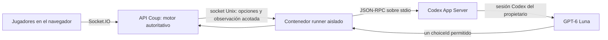

# Jugadores de Coup con Codex

Esta guía conserva cómo montar la prueba temporal de jugadores GPT-6 Luna usando la sesión Codex del propietario. Describe el diseño actual del branch `issue/14-codex-ai-players`; no es una receta de servicio público ni una garantía de disponibilidad.

> **Estado experimental.** La integración usa Codex App Server, cuyo protocolo oficial se declara experimental y sin soporte de producción. La sesión, los permisos del plan y el acceso al modelo dependen de la cuenta que inicia sesión. Esta ruta no usa una API key ni configura facturación de API; tampoco promete uso gratuito o ilimitado. Si Codex, la cuota o Luna no están disponibles, la partida se pausa sin cambiar de proveedor. Consulta [Codex App Server](https://learn.chatgpt.com/docs/app-server), [comandos y autenticación de Codex](https://learn.chatgpt.com/docs/developer-commands) y las condiciones vigentes de tu cuenta.

## Arquitectura



El API prepara cada decisión a partir del estado del juego. Envía al runner la mano privada del asiento IA que decide, la información pública de la mesa y el historial público acotado; no envía las manos de los demás. Las reglas y las opciones legales vienen del servidor. El modelo solo puede devolver un `choiceId` de esa lista. El runner, el cliente del API y el motor validan la respuesta, la versión del estado y las reglas antes de aplicar una jugada. Una respuesta inválida, vencida o fallida pausa el juego.

El runner ejecuta `codex app-server --listen stdio://` dentro de un contenedor separado. El API y el runner comparten solo un socket Unix y el marcador de apagado; el API no monta el volumen de sesión. El runner no publica puertos ni monta el checkout del juego; tiene rootfs de solo lectura, usuario sin privilegios y límites de recursos. La red de salida del runner es distinta de la red de Coup; el Compose no configura por sí mismo una lista blanca de destinos de internet.

La integración usa una conversación efímera por decisión; cada asiento recibe únicamente su observación y no comparte deliberadamente memoria privada con otros asientos. El contexto incluye las reglas derivadas de la transcripción versionada (`b189cc0` al escribir esta guía), las cartas propias, los hechos públicos y las opciones legales. No carga automáticamente `docs/coup_llm_summary.md` ni le da al modelo acceso al repo, shell, navegador, herramientas, otras apps o agentes. El prompt pide razonar con evidencia y probabilidades, no mentir siempre. Puede inferir con datos públicos, pero desconoce cartas ocultas y no es invencible.

El modelo está fijado como `gpt-6-luna`. Cada asiento IA elige esfuerzo `low`, `medium` o `high`; `medium` es el valor predeterminado. Se pueden agregar varios asientos: por ejemplo, una persona contra dos IA, o IA contra IA con el creador como espectador, hasta el máximo actual de seis participantes.

## Preparar el release

Requisitos: el release de Coup debe tener su Compose base y Dockerfiles habituales, Docker Engine con Compose v2 y una cuenta de servidor con permisos de despliegue. En el release, deben estar estos archivos de esta rama:

- `deploy/codex-ai.compose.yml`
- `deploy/Dockerfile.codex-runner`
- `deploy/codex-runner-entrypoint.sh`
- el código de `server/ai/` usado por el Dockerfile

Conserva el directorio del release anterior para poder volver atrás. En el `.env` privado del nuevo release establece `COUP_REVISION` al SHA desplegado y crea un `COUP_AI_ACCESS_CODE` aleatorio de al menos 24 caracteres. Si el archivo es nuevo, debe contener al menos:

```dotenv
COUP_REVISION=<sha-completo-del-release>
```

Añade el código compartido a un `.env` nuevo sin mostrar su valor en la terminal:

```sh
printf 'COUP_AI_ACCESS_CODE=' >> .env
openssl rand -hex 24 >> .env
chmod 600 .env
```

No guardes el código en Git, una URL, una captura o un log. No hace falta crear cuentas para los amigos: el líder introduce el código compartido en el lobby. El servidor compara el código en tiempo constante, limita intentos y conserva la autorización solo para el socket líder de esa sala.

Desde `deploy/` del nuevo release, combina el Compose base con el overlay:

```sh
docker compose -p deploy -f docker-compose.yml -f codex-ai.compose.yml config
docker compose -p deploy -f docker-compose.yml -f codex-ai.compose.yml up -d --build --wait
docker compose -p deploy -f docker-compose.yml -f codex-ai.compose.yml ps
```

El runner usa `@openai/codex@0.157.1`, fijado en `deploy/Dockerfile.codex-runner`. Para actualizarlo, cambia el pin y repite validación de protocolo, build, healthcheck y una llamada real antes de desplegar.

## Estado actual de Hetzner

Al 2026-09-27, el web se sirve desde `coup-web:84b6f96`; API y runner siguen en `4ab5e52` y están saludables. Se reconstruyó y reemplazó solo `coup-web` para ocultar el control de emergencia a invitados sin reiniciar el API ni cerrar salas activas. El host sirve la página y el bundle `main.76e01582.js` con HTTP 200. El `.env` privado se conservó con modo `600`. Un despliegue completo futuro puede mover API y runner a un único release; reiniciar el API cierra las salas actuales.

## Autorizar Codex

El volumen Docker `coup_codex_state` conserva la autenticación privada (`CODEX_HOME`) y los límites de uso del runner. El contenedor del API no lo monta. No copies `auth.json` al repo, al `.env`, a un ticket o al chat.

Si tu cuenta permite autenticación por código de dispositivo, ejecuta esto en el servidor:

```sh
docker compose -p deploy -f docker-compose.yml -f codex-ai.compose.yml \
  exec -it coup-codex-runner codex login --device-auth
```

Si esa opción no está disponible, usa el OAuth normal de navegador con un túnel SSH temporal que devuelva el callback a `localhost:1455`. El procedimiento aislado de túnel y contenedor de login está en el [runbook de la prueba](../plans/codex-ai-players/poc-runbook.md); cierra el túnel al terminar. En ambos casos confirma el estado sin mostrar credenciales:

```sh
docker compose -p deploy -f docker-compose.yml -f codex-ai.compose.yml \
  exec coup-codex-runner codex login status
```

El primer turno real comprueba si esa sesión puede usar `gpt-6-luna` mediante App Server. No se cambia automáticamente a API ni a otro modelo si falla.

## Probar en el lobby

1. Crea una sala y comparte su código de sala con tus amigos.
2. Como líder, introduce el código de IA privado y añade uno o más asientos GPT-6 Luna con el esfuerzo deseado.
3. Prueba una partida humana contra dos IA y otra IA contra IA dejando al creador como espectador.
4. Revisa desafíos, bloqueos, pérdida de influencia, timeout y desconexión del runner.
5. Comprueba el apagado de emergencia. Solo el líder que validó el código ve el control rojo, tanto en el lobby como durante la partida; los demás clientes no lo renderizan y el servidor también rechaza sus eventos. El apagado es global, cancela solicitudes activas, pausa juegos que esperan una decisión IA y persiste tras reinicios. Solo el propietario lo rearma desde SSH.

Reiniciar el API cierra las salas actuales. Las cuotas iniciales del runner son dos decisiones concurrentes, doce en cola, 120 llamadas por partida, 240 por hora y 45 segundos por decisión.

## Apagar, rearmar o retirar

La palanca roja deja un marcador persistente; reiniciar contenedores no rearma Codex. El rearme se realiza manualmente por SSH, quitando el marcador y recreando runner/API. El comando concreto está en la sección **Palanca roja y rearme** del [runbook](../plans/codex-ai-players/poc-runbook.md). No existe un evento público de reactivación.

Para rollback, levanta el release anterior con su Compose base y `--remove-orphans`, sin el overlay IA. Al retirar completamente la prueba, elimina explícitamente `coup_codex_state`, `coup_codex_socket` y `coup_codex_control`; borrar el primero elimina la sesión Codex guardada.

## Referencias

- [Codex App Server](https://learn.chatgpt.com/docs/app-server)
- [Comandos y autenticación de Codex](https://learn.chatgpt.com/docs/developer-commands)
- [Runbook de despliegue, login OAuth y rollback en Hetzner](../plans/codex-ai-players/poc-runbook.md)
- [Contrato del runner](../plans/codex-ai-players/f2_codex_runner.md)
- [Plan y decisiones del issue #14](../plans/codex-ai-players/plan_codex_ai_players.md)
